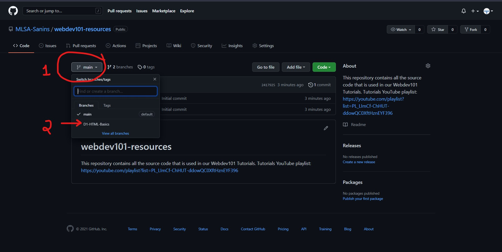
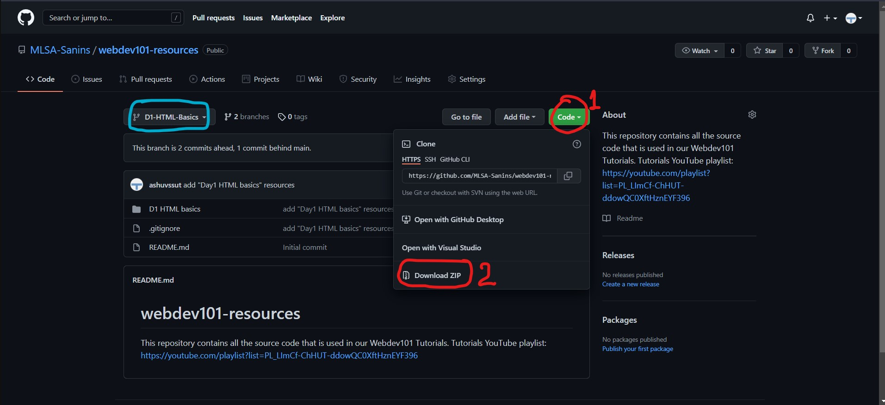

# webdev101-resources

Webdev 101 is a Frontend Web Development Bootcamp course. You will be taught HTML and CSS from Basic to Advanced.

This repository contains all the source code that is used in our Webdev101 Tutorials. Webdev101 Tutorials YouTube [playlist link](https://youtube.com/playlist?list=PL_LImCf-ChHUT-ddowQC0XftHznEYF396)

**The Tutorial resources contains 2 folder**:
- ***Project folder*** - Contails all project source code that was written by the instructor in the session.
- ***Assignment folder*** - Contains the problem statement for the Assignment for the day. Submit your assignments in Google Classroom. [Google Classroom invite link](https://classroom.google.com/c/NDA1OTI1NDUzNzMz?cjc=cxibbjv)

## To Download the tutorial resources follow to two steps given as follows

> Suppose you want to download the tutorial resources for Day1 HTML Basics. Follow the steps given below.

#### Step 1: Find the tutorial resources you are looking for:

  1. click on the branch button (Red-marked as 1)
  2. click on the tutorial resource you are looking for. In our example case we are looking for Day 1 HTML Basics resources, so click on D1-HTML-Basics branch (Red-marked as 2)

#### Step 2: Download the tutorial resources!

  1. Click on **Code** button. (Red-marked as 1)
  2. Click on **Download ZIP** button (Red-marked as 2)

> **Note** : see the blue-marked button. It represents the tutorial resouces that you navigated to. You can click on that button again and switch to other tutorial resources if you want!
